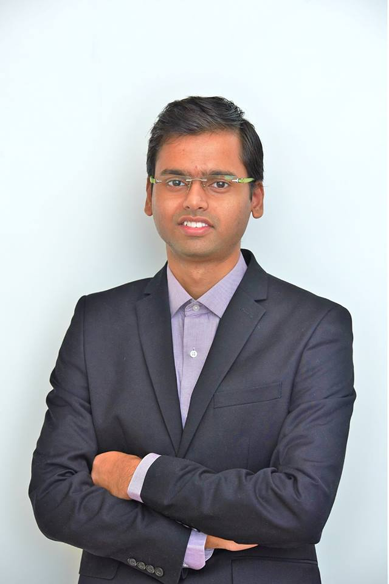

# Pramit Saha #

Hi there! Thanks for visiting my page! 

I am Pramit Saha, a MITACS Globalink Graduate Fellow, currently studying Master’s of Applied Science (MASc) in the Electrical and Computer Engineering Department at the University of British Columbia, Vancouver, Canada. I am a research assistant in the Human Communication Technologies Laboratory (HCT Lab), supervised by Prof. Sidney Fels. I am also working with Prof. Bryan Gick, the director of UBC Interdisciplinary Speech Research Lab (ISRL) and the head of Department of Linguistics, UBC as well as Prof. Muhammad Abdul-Mageed, the director of UBC Natural Language Processing (NLP) Lab. Besides my graduate research assistantship position, I am also acting as the Treasurer and Executive Committee Member (2018-2020) of the ECE Graduate Student Association (ECEGSA).

Before joining the HCT Lab, I was a MITACS Globalink Research Intern in the Faculty of Medicine and Dentistry, Department of Radiology and Diagnostic Imaging, advised by Dr. Lawrence Le. I obtained my Bachelor of Engineering (B.E) degree in Electrical Engineering from Jadavpur University, Kolkata, India, my final year project being under Prof. Amitava Chatterjee. During my junior year, I interned on the 3D Medical Image Processing area, in the Electronics and Electrical Communication Engineering Department at the Indian Institute of Technology (IIT Kgp), jointly supervised by Prof. Sudipta Mukhopadhyay and Prof. Ashis Kumar Dhara. In my senior year, I worked as a research intern in the Tomography Lab, Department of Electrical Engineering, at the Indian Institute of Science (IISc Bangalore) under Prof. Kasi Rajgopal. 
 
My current research primarily centers around Deep Learning, Bayesian Inference, Speech Synthesis, Design and Control of Silent Speech Interfaces, and Computer Vision. Other interests include Human Motor Control, Medical Image Analysis and Reconstruction, Natural Language Processing, Brain-Computer Interfaces, and other Human-Computer Interfaces. 
			
Email: `pramit_at_ece_dot_ubc_dot_ca`
